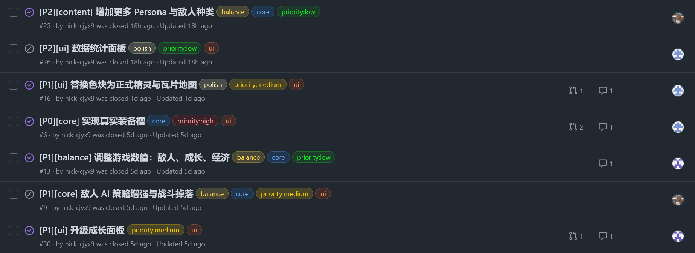
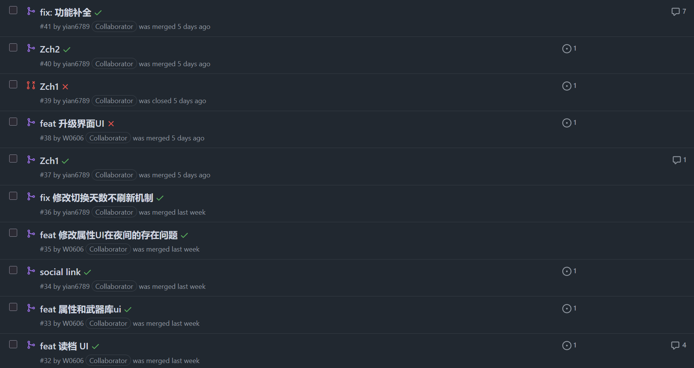
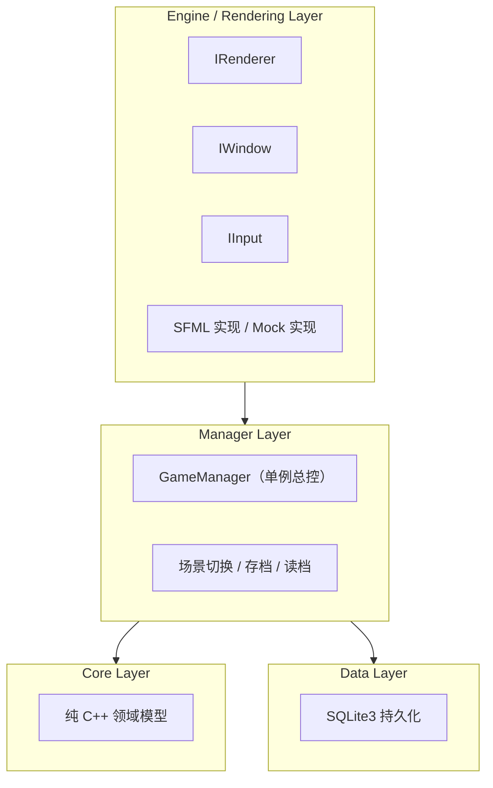
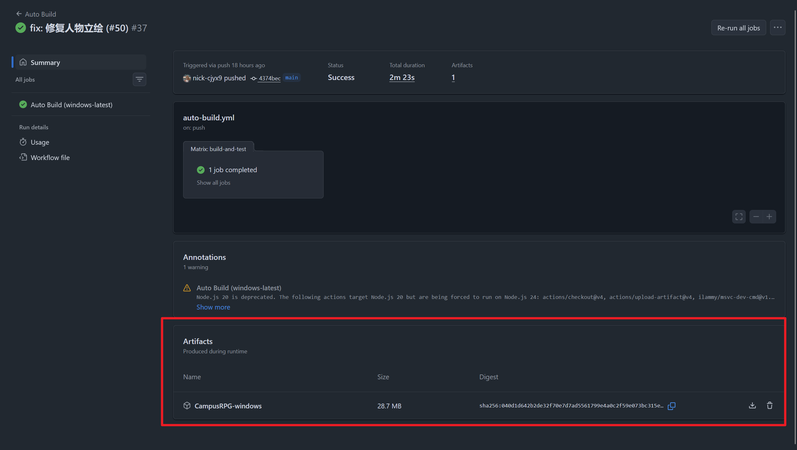
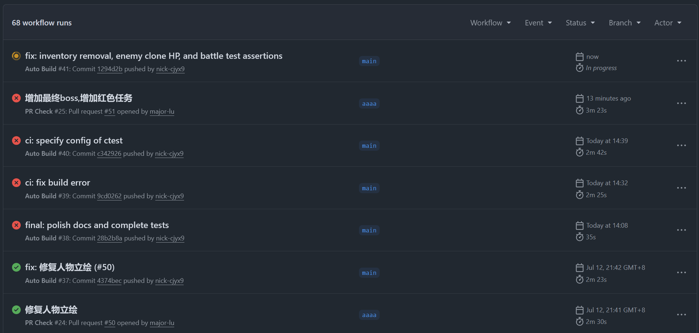

# CampusRPG

## 校园 RPG 冒险游戏系统

基于 C++20 + SFML + SQLite3 + CMake

<div class="mt-8 text-sm opacity-75">
角色管理 · 背包系统 · 商店系统 · 任务系统 · 战斗系统 · 等级成长
</div>

<!--
开场：介绍项目主题、技术栈，点明本次答辩将重点讲解 core/ 程序设计思想与测试体系。
-->

---
layout: two-cols
layoutClass: gap-12
---

# 目录

1. 项目背景与目标
2. 团队分工与进度
3. 系统功能总览
4. 架构与分层设计
5. **core/ 程序设计思想**
6. **测试体系与结果**
7. UI 与挑战任务
8. 总结与展望

---
layout: center
class: text-center
---

# 01 项目背景与目标

---

# 项目背景

- **主题**：以《女神异闻录》系列为灵感的 2D 校园 RPG 简化版
- **核心玩法循环**：
  - 早晨：城镇/学校 2D 地图移动、与 NPC 对话、推进 Social Link
  - 夜晚：地图变暗、出现阴影、触发回合制战斗
  - 战斗胜利：获得 EXP、金币、掉落 Persona
  - 回家睡觉：进入下一天
- **课程目标**：综合运用面向对象程序设计、STL、数据持久化、团队协作与测试验证

<div class="mt-4 text-sm">

**源码仓库结构**：

```text
campus-rpg/
├── src/core/          # 纯 C++ 领域模型（可单元测试）
├── src/data/          # SQLite3 持久化
├── src/manager/       # GameManager 总控
├── src/engine/        # 渲染/输入抽象接口 + SFML 实现
├── src/scenes/        # 场景系统
└── tests/             # 单元/Mock/持久化测试
```

</div>

---

# 课程要求覆盖矩阵

| 大作业要求 | 实现说明 |
| --- | --- |
| 角色管理 | `Character` + `Persona` |
| 背包管理 | `Inventory` + `Item` 继承体系 |
| 商店系统 | `Shop` 购买/出售/金币结算 |
| 任务系统 | `Quest` + `QuestManager` |
| 战斗系统 | `BattleSystem` 回合制 |
| 等级成长 | 角色升级 + Persona 升级 |
| 面向对象 | 封装、继承、多态、关联 |

---

| 大作业要求 | 实现说明 |
| --- | --- |
| STL 容器 | `vector` / `map` / `array` 等 |
| 数据持久化 | SQLite3 多存档 |
| 人机交互 | SFML 图形界面 |
| 挑战任务 | 数据库、GUI、STL 高级、软件工程 |


---
layout: center
class: text-center
---

# 02 团队分工与项目进度

---

# 团队分工

| 姓名 | 学号 | 角色 | 负责模块 | 主要工作内容 |
| --- | --- | --- | --- | --- |
| 陈俊宇 | 1030425330 | 组长 / 项目管理 | 项目整体管理、任务协调、战斗系统 | 负责项目整体进度把控、GitHub 仓库管理、代码审查、战斗系统设计与实现 |
| 王子衿 | 1030425331 | 核心开发 | 角色管理模块、等级成长模块 | 负责角色类设计、角色属性管理、经验值与等级成长机制、存档读取功能 |
| 路美杰 | 1030425329 | 核心开发 | 背包管理模块、商店系统模块 | 负责物品类设计、背包系统、商店交易、金币结算 |
| 祖程浩 | 1030425328 | 开发 / 测试 / 文档 | 任务系统模块、测试与文档 | 负责任务类设计、任务流程管理、系统测试、课程设计报告与 PPT 编写 |


---

# 团队协作

我们基于 Git 进行版本管理，在 GitHub 远程仓库设置了严格的主分支保护，各自在分支开发，通过 PR 维护仓库状态，issues 分配各自任务。

| issues | Pull Requests |
| --- | --- |
|  | |
---
layout: center
class: text-center
---

# 03 系统功能总览

---

# 六大基础模块

<div grid="~ cols-3 gap-4">

<div class="p-3 rounded bg-primary/10">

### 角色管理
- 创建角色
- 查看信息
- 属性管理
- 存档/读档

</div>

<div class="p-3 rounded bg-primary/10">

### 背包管理
- 获得物品
- 查看背包
- 使用物品
- 删除物品

</div>

<div class="p-3 rounded bg-primary/10">

### 商店系统
- 查看商品
- 购买商品
- 出售物品
- 金币结算

</div>

<div class="p-3 rounded bg-primary/10">

### 任务系统
- 查看任务
- 接受任务
- 完成任务
- 领取奖励

</div>

<div class="p-3 rounded bg-primary/10">

### 战斗系统
- 选择敌人
- 攻击/受击
- 生命值变化
- 结果判定

</div>

<div class="p-3 rounded bg-primary/10">

### 等级成长
- 经验值累计
- 等级提升
- 属性增长
- 成长展示

</div>

</div>

---
layout: center
class: text-center
---

# 04 架构与分层设计

---

# 四层架构

<div class="flex justify-center">


</div>

<div class="mt-2 text-sm">

**设计原则**：上层依赖接口，不依赖具体实现；`core/` 与 SFML/SQLite 解耦，保证可测试性。

</div>

---

# CMake 库划分

| 目标 | 源码 | 依赖 | 说明 |
| --- | --- | --- | --- |
| `CampusRPGCore` | `src/core/*.cpp` | 纯 C++ | 领域模型，供测试链接 |
| `CampusRPGAppLib` | `data/` + `manager/` + `scenes/` | `Core` + SQLite3 | 应用层 |
| `CampusRPGEngineInterface` | `src/engine/interfaces/*.h` | 头文件接口 | 抽象接口库 |
| `CampusRPG` | `main.cpp` + `engine/sfml/*` | `AppLib` + SFML | 可执行程序 |
| `CampusRPGTests` | `tests/*.cpp` + `mocks/` | `Core` | 单元测试 |

<div class="mt-4 text-sm">

**工程价值**：测试目标只链接 `CampusRPGCore`，无需 GUI 事件循环；场景层通过 `IRenderer` / `IInput` 与 SFML 解耦，便于 Mock 测试。

</div>

---
layout: center
class: text-center
---

# 05 core/ 程序设计思想

---

# OOP 四项特征总览

1. **封装（Encapsulation）**
   - 所有领域类字段私有，暴露公共 getter/setter
   - 状态变更通过方法完成，例如 `Character::gainExp()`、`Persona::levelUp()`

2. **继承（Inheritance）**
   - 抽象基类：`Item`、`Enemy`、`Entity`、`Skill`、引擎接口
   - 派生类：`FoodItem` / `PotionItem` / `EquipmentItem` / `PersonaItem`

---

3. **多态（Polymorphism）**
   - `item->use(character)`、`enemy->battleCry()`、`renderer->drawRect()`
   - 运行时绑定不同子类行为

4. **关联（Association）**
   - `GameManager` 聚合 `Character`、`Inventory`、`Shop`、`QuestManager`、`SocialLinkManager`、`TileMap`

---

# 封装：Character 与 Persona

`Character` 维护等级、HP/SP、金币，**战斗三维来自当前 Persona + 装备**。

```cpp
class Character {
public:
    int attack() const;  // 来自当前 Persona + 装备
    int magic()  const;
    int speed()  const;
    void takeDamage(int damage);
    void heal(int amount);
    void gainExp(int amount);
    void setPersona(std::shared_ptr<Persona> persona);
private:
    void levelUp();
    int computePersonaStat(PersonaStat s) const;
    // ...
};
```

<div class="mt-2 text-sm">

**属性公式**（`docs/core.md`）：

$$\text{最终属性} = (\text{基础属性} + \text{装备加成}) \times [1 + (\text{等级}-1) \times 0.05]$$

</div>

---

# 封装：Persona 作为唯一战斗属性源

```cpp
class Persona {
public:
    int stat(PersonaStat s) const;
    Affinity affinity(Element e) const;
    void learnSkill(std::shared_ptr<Skill> skill);
    void addPotentialSkill(int level, std::shared_ptr<Skill> skill);
    std::vector<std::shared_ptr<Skill>> checkSkillUnlocks(int currentLevel);
    void gainExp(int amount);
    void growBaseStats(double multiplier = 1.05);
private:
    std::map<PersonaStat, int> stats_;
    std::map<Element, Affinity> affinities_;
    std::vector<std::shared_ptr<Skill>> skills_;
    std::vector<std::pair<int, std::shared_ptr<Skill>>> potentialSkills_;
};
```

<div class="mt-2 text-sm">

**设计要点**：`Character` 只负责角色等级与 HP/SP；所有战斗属性、元素抗性、技能均由 `Persona` 提供，实现职责分离。

</div>

---

# 继承与多态：Item 与 Enemy 体系

```cpp
class Item {
public:
    virtual std::unique_ptr<Item> clone() const = 0;
    virtual void use(Character &character) = 0;
};

class FoodItem : public Item { /* 回复 HP */ };
class EquipmentItem : public Item { /* 提升三维 */ };
class PersonaItem : public Item { /* 获得 Persona */ };

class Enemy {
public:
    virtual std::string battleCry() const = 0;
    virtual std::unique_ptr<Enemy> clone() const = 0;
    std::shared_ptr<Skill> chooseSkill(size_t turnIndex) const;
    void scaleToLevel(int playerLevel, double extra = 1.0);
};

class Slime : public Enemy { /* ... */ };
class Boss  : public Enemy { /* ... */ };
```

<div class="mt-2 text-sm">

**多态体现**：背包统一存储 `std::unique_ptr<Item>`，`BattleSystem` 持有 `std::unique_ptr<Enemy>`，运行时绑定具体行为。

</div>

---

# 继承与多态：引擎抽象接口

```cpp
class IRenderer {
public:
    virtual void clear() = 0;
    virtual void drawRect(const Rect& rect, Color color) = 0;
    virtual void drawText(const std::string& text, const Vec2& pos, int size) = 0;
};

class IWindow {
public:
    virtual bool isOpen() const = 0;
    virtual void pollEvents(IInput& input) = 0;
    virtual IRenderer& renderer() = 0;
};

class IInput {
public:
    virtual bool isKeyPressed(Key key) const = 0;
    virtual bool wasKeyJustPressed(Key key) = 0;
};
```

<div class="mt-2 text-sm">

**工程价值**：`SfmlRenderer` / `SfmlInput` 用于运行期，`MockRenderer` / `MockInput` 用于测试，同一接口两套实现。

</div>

---

# 关联：GameManager 聚合关系

```cpp
class GameManager {
public:
    static GameManager &instance();
    Character &character() { return character_; }
    Inventory &inventory() { return inventory_; }
    Shop &shop() { return shop_; }
    QuestManager &questManager() { return questManager_; }
    SocialLinkManager &socialLinkManager() { return socialLinkManager_; }
    TileMap &currentMap() { return onSecondMap_ ? *secondMap_ : *currentMap_; }
    BattleSystem &battleSystem() { return battleSystem_; }
private:
    Character character_;
    Inventory inventory_;
    Shop shop_;
    QuestManager questManager_;
    SocialLinkManager socialLinkManager_;
    std::unique_ptr<TileMap> currentMap_;
    BattleSystem battleSystem_;
};
```

<div class="mt-2 text-sm">

**关联设计**：`GameManager` 作为单例协调器，通过组合/聚合持有各子系统，避免子系统之间直接依赖。

</div>

---

# STL 应用总览

| STL 容器 | 使用位置 | 选型理由 |
| --- | --- | --- |
| `std::vector` | `Inventory::items_`、`Enemy::skills_`、`Persona::skills_`、`BattleSystem::log_` | 顺序存储、随机访问 |
| `std::map` | `QuestManager::quests_`、`SocialLinkManager::links_`、`Persona::stats_` | 按键查找、天然有序 |
| `std::shared_ptr` | `Persona` 共享、装备共享 | 多对象共享同一份数据 |
| `std::unique_ptr` | `Inventory` 物品、`Enemy` 敌人、`TileMap` 实体 | 明确所有权、自动释放 |
| `std::array` | `MockInput` 按键状态 | 固定大小、无额外开销 |


---

# 战斗系统：Initiative 与伤害

```cpp
void BattleSystem::buildTurnOrder() {
    TurnEntry playerEntry{true, 0,
        static_cast<int>(playerSpeed * (1.0 + dist(rng)))};
    turnOrder_.push_back(playerEntry);
    for (size_t i = 0; i < enemies_.size(); ++i) {
        turnOrder_.push_back({false, i,
            static_cast<int>(enemies_[i]->speed() * (1.0 + dist(rng)))});
    }
    std::sort(turnOrder_.begin(), turnOrder_.end(),
              [](const auto &a, const auto &b) {
                  if (a.initiative != b.initiative)
                      return a.initiative > b.initiative;
                  return a.isPlayer && !b.isPlayer;
              });
}
```

<div class="mt-2 text-sm">

**公式**：

- Initiative: $\text{speed} \times (1 + \text{random}(-10\%, +10\%))$
- 物理伤害: $\text{basePower} \times (1 + \text{strength}/10)$
- 闪避率: $\text{clamp}\left(\frac{\text{defSpeed}-\text{atkSpeed}}{\text{atkSpeed}} \times 0.5,\, 5\%,\, 50\%\right)$

</div>

---

# Persona 成长与 Social Link

```cpp
void Persona::levelUp() {
    ++level_;
    expToNextLevel_ = static_cast<int>(expToNextLevel_ * 1.5);
    growBaseStats(1.05);
    checkSkillUnlocks(level_);
}

void Persona::growBaseStats(double multiplier) {
    for (auto &kv : stats_) {
        kv.second = static_cast<int>(kv.second * multiplier);
        if (kv.second < 1) kv.second = 1;
    }
}
```

<div class="mt-2 text-sm">

**Social Link 奖励**：Rank 提升时，所有 Arcana 匹配的已拥有 Persona 各升 1 级，并可能解锁新技能。

</div>

---

# 数据持久化：SQLite3 多存档

```text
character       -- 角色基础属性、当前 Persona ID
persona         -- Persona 属性与拥有者
inventory       -- 背包物品
social_link     -- NPC 羁绊等级与进度
quest_progress  -- 任务接受/完成/领奖状态
save_meta       -- 存档元信息
```

<div class="mt-4 text-sm">

**多存档支持**：`SaveRepository` 支持 `saveAll(slotId, ...)` / `loadAll(slotId, ...)`，实现插槽独立、覆盖、删除、列表查询。

</div>

---
layout: center
class: text-center
---

# 06 测试体系与结果

---

# 测试策略总览

1. **核心单元测试** — `tests/test_core.cpp`
   - 链接 `CampusRPGCore` 静态库
   - 纯 C++，无 SFML/SQLite 依赖
   - lightweight `CHECK` / `CHECK_EQ` 宏

2. **场景 Mock 测试** — `tests/test_levelup.cpp`
   - 使用 `MockRenderer` / `MockInput`
   - 验证 UI 渲染调用与输入响应

3. **持久化测试** — `tests/test_save.cpp`
   - 链接 `CampusRPGAppLib` + SQLite3
   - 验证存档/读档、多槽独立、Schema 迁移

4. **CI 自动化** — `.github/workflows/pr-check.yml`
   - Windows + Ubuntu 双平台构建与测试

---

# 核心单元测试框架

```cpp
// tests/test_core.cpp
namespace {
    int g_run = 0;
    int g_failed = 0;

    void record(bool ok, const char *expr, const char *file, int line) {
        ++g_run;
        if (!ok) {
            ++g_failed;
            std::cerr << "FAIL: " << expr << "  (" << file << ':' << line << ")\n";
        }
    }

#define CHECK(expr) record(static_cast<bool>(expr), #expr, __FILE__, __LINE__)
#define CHECK_EQ(a, b) record((a) == (b), #a " == " #b, __FILE__, __LINE__)
}

int main() {
    testCharacterGainExpTriggersLevelUp();
    // ... 约 40 个测试函数
    return g_failed == 0 ? 0 : 1;
}
```

<div class="mt-2 text-sm">

**设计优点**：不引入外部测试框架，零依赖、启动快、失败不 abort，适合 CI 快速回归。

</div>

---

# 测试覆盖：Character / Persona

```cpp
void testCharacterLevelUpSnapshotPopulated() {
    Character hero("Hero", 100, 50);
    hero.gainExp(100);
    const auto &snap = hero.levelUpSnapshot();
    CHECK_EQ(snap.oldLevel, 1);
    CHECK_EQ(snap.newLevel, 2);
    CHECK(snap.newMaxHp > snap.oldMaxHp);
    CHECK(snap.newMaxSp > snap.oldMaxSp);
}

void testEquipmentItemBoostsStrength() {
    Character hero("Hero", 100, 50);
    hero.setPersona(makeBasicPersona("p", 10, 10, 10));
    int baseAttack = hero.attack();
    EquipmentItem sword("eq_sword", "Sword", "...", 50, 5, 0, 0, EquipmentSlot::Weapon);
    sword.use(hero);
    CHECK_EQ(hero.attack(), baseAttack + 5);
}

void testPersonaSkillUnlockOnLevelUp() {
    Persona p("p_test", "Test", "Fool", 1, 5, 5, 5);
    p.addPotentialSkill(3, skill);
    p.gainExp(999);
    CHECK(p.findSkill("skill_test") != nullptr);
}
```


---

# 测试覆盖：Inventory / Shop

```cpp
void testInventoryUseItemAppliesEffectAndRemovesIt() {
    Inventory inv;
    inv.addItem(std::make_unique<PotionItem>("potion_hp", "HP Potion", "...", 30, 50));
    Character hero("Hero", 100, 50);
    hero.takeDamage(60);
    CHECK(inv.useItem(0, hero));
    CHECK(hero.hp() > 40);
    CHECK(inv.empty());
}

void testShopBuyItemTransfersItemAndConsumesGold() {
    Shop shop;
    shop.addItem(std::make_unique<FoodItem>("food_bread", "Bread", "...", 10, 15));
    Character buyer("Buyer", 100, 50);
    buyer.addGold(100);
    Inventory inv;
    CHECK(shop.buy(0, buyer, inv));
    CHECK_EQ(inv.size(), 1u);
    CHECK_EQ(buyer.gold(), 90);
}
```

<div class="mt-2 text-sm">

**验证点**：物品效果、背包容量、商店买卖金币结算。

</div>

---

# 测试覆盖：BattleSystem

```cpp
void testBattleStrongPlayerDefeatsSlime() {
    Character hero("Hero", 100, 50);
    hero.setPersona(makeBasicPersona("p", 20, 20, 20));
    Slime slime;
    BattleSystem battle;
    battle.startBattle(hero, slime);
    int safety = 0;
    while (!battle.isOver() && safety < 100) {
        if (battle.isPlayerTurn()) battle.playerAttack();
        ++safety;
    }
    CHECK(battle.isOver());
    CHECK(battle.playerWon());
}

void testBattleItemIsFreeAction() {
    battle.playerUseItem(std::move(potion));
    CHECK(hero.hp() > hpBefore);
    CHECK(battle.isPlayerTurn()); // free action
}
```

<div class="mt-2 text-sm">

**验证点**：战斗胜负判定、物品免费动作、切换 Persona 消耗回合。

</div>

---

# 测试覆盖：SocialLink / Quest

```cpp
void testSocialLinkAddPointsReturnsRanksGained() {
    SocialLink link("sl_test", "Test", "Fool");
    int gained = link.addPoints(20);  // 0->1 需 20 点
    CHECK_EQ(gained, 1);
    CHECK_EQ(link.rank(), 1);
    gained = link.addPoints(100);     // 1->2 需 40，2->3 需 60
    CHECK_EQ(gained, 2);
    CHECK_EQ(link.rank(), 3);
}

void testQuestManagerAddKillProgress() {
    QuestManager qm;
    Quest q("quest_test", "Test", "Defeat 2 shadows", "kill:2", 50, 20);
    q.setType(QuestType::Kill);
    q.setTargetCount(2);
    qm.addQuest(std::move(q));
    qm.acceptQuest("quest_test");
    qm.addKillProgress(1);
    CHECK(!qm.getQuest("quest_test")->isCompleted());
    qm.addKillProgress(1);
    CHECK(qm.getQuest("quest_test")->isCompleted());
}
```

<div class="mt-2 text-sm">

**验证点**：Social Link 连升多级、Quest 击杀进度自动推进与完成判定。

</div>

---

# Mock 测试：场景渲染与输入

```cpp
void testLevelUpSceneRendersPanel() {
    GameManager::instance().newGame("TestHero");
    auto &c = GameManager::instance().character();
    c.gainExp(100);

    LevelUpScene scene;
    tests::MockRenderer renderer;
    scene.render(renderer);

    bool hasTitle = false;
    for (const auto &call : renderer.textCalls())
        if (call.text == "LEVEL UP!") hasTitle = true;
    CHECK(hasTitle);
}

class MockRenderer : public engine::IRenderer {
public:
    void drawRect(const engine::Rect &r, engine::Color c) override;
    void drawText(const std::string &t, const engine::Vec2 &p,
                  int size, engine::Color c) override;
    // ...
};
```

<div class="mt-2 text-sm">

**验证点**：升级场景绘制标题；无需启动 SFML 窗口即可断言渲染行为。

</div>

---

# 持久化测试与 CI

```cpp
void testMultipleSlotsAreIndependent() {
    TempDatabase db("test_save_multi.db");
    SaveRepository repo;
    Character a("Alice", 100, 50); a.addGold(100);
    Character b("Bob", 120, 60);   b.addGold(500);
    repo.saveAll(1, a, invA, pa, slmA, qmA);
    repo.saveAll(2, b, invB, pb, slmB, qmB);

    auto slots = repo.listSlots(3);
    CHECK_EQ(slots[0].characterName, "Alice");
    CHECK_EQ(slots[1].characterName, "Bob");

    Character loaded;
    CHECK(repo.loadAll(2, loaded, li, lp, ls, lq));
    CHECK_EQ(loaded.name(), "Bob");
    CHECK_EQ(loaded.gold(), 500);
}
```

<div class="mt-2 text-sm">

**GitHub Actions**：每次 PR 在 GitHub 的 actions 云端上自动构建 + 运行全部测试。

</div>

---

# CI 相关截图展示

| 自动 release 产物 | actions |
| --- | --- |
|  |  |

---

# 项目特色与创新

| 特色/创新点 | 说明 |
| --- | --- |
| **Persona 双轨成长** | 角色等级影响 HP/SP 与敌人缩放；Persona 等级通过 Social Link 成长 |
| **战斗三维统一** | 角色与敌人都只有 STR/MAG/SPD，无独立防御，简化平衡 |
| **引擎抽象层** | `IRenderer`/`IWindow`/`IInput` 让核心逻辑与 SFML 解耦 |
| **多存档 SQLite** | 完整持久化角色、Persona、背包、任务、Social Link |
| **轻量测试框架** | 自研 `CHECK`/`CHECK_EQ` 宏，零依赖，适合 CI 快速回归 |
| **Social Link 奖励** | Rank 提升按 Arcana 匹配自动升级 Persona，并可能解锁新技能 |

---
layout: center
class: text-center
---

# 07 UI 与挑战任务

---

# UI 与场景系统

- 基于抽象接口 `IRenderer` / `IWindow` / `IInput`，场景层不直接依赖 SFML
- 主要场景：
  - `TitleScene`：标题与开始/继续
  - `TownScene` / `NightScene`：2D 地图移动与交互
  - `BattleScene`：回合制战斗 UI
  - `ShopScene` / `InventoryScene` / `StatusScene`：背包、商店、角色面板
  - `DialogueScene` / `SocialLinkScene`：NPC 对话与羁绊
  - `LevelUpScene` / `QuestScene` / `SaveSlotScene`：升级、任务、存档


---

# 已完成的挑战任务

| 挑战任务 | 实现内容 | 对应源码 |
| --- | --- | --- |
| **数据库** | SQLite3 多存档持久化 | `src/data/DatabaseManager.cpp`、 `src/data/SaveRepository.cpp` |
| **UI** | SFML 2D 图形界面 + 多场景 | `src/engine/sfml/*`、`src/scenes/*` |
| **STL** | `vector`/`map`/`shared_ptr`/`unique_ptr`/`sort`/`clamp` | `src/core/*.h`、`src/core/*.cpp` |
| **软件工程实践** | Git 协同、单元测试、自动化构建、持续集成 | `tests/*`、`.github/workflows/*`、CMake Presets |


---

# 系统演示

| a | b | c |
| --- | --- | --- |
| a | b | c |
| a | b | c |
| a | b | c |

---
layout: center
class: text-center
---

# 08 总结与展望

---

# 项目总结

- **面向对象设计**：封装、继承、多态、关联在 `core/` 中得到充分体现
- **STL 应用**：`vector`、`map`、`shared_ptr`、`unique_ptr` 等容器覆盖全部核心系统
- **可测试架构**：`core/` 纯 C++ 无外部依赖，支持轻量级单元测试；引擎抽象接口支持 Mock 测试
- **工程化**：CMake Presets、SQLite 持久化、GitHub Actions CI 跨平台自动构建
- **挑战任务**：数据库、GUI、STL 高级、软件工程实践四项全部完成

---

# 未来展望

- **Persona 合成系统**：按父母 Persona 与合成新 Persona，继承技能
- **更多任务类型**：扩展 `collect:id:N`、`level:N` 条件
- **更丰富的敌人 AI**：引入状态机或行为树，替代固定出招循环
- **网络/多人同步**：尝试 Socket 通信实现联机对战或数据同步
- **更完善的测试覆盖**：为 `GameManager` 状态机、`BattleSystem` 边界条件补充更多测试

---
layout: center
class: text-center
---

# 感谢聆听


**CampusRPG 校园 RPG 冒险游戏系统**


<PoweredBySlidev mt-10 />
